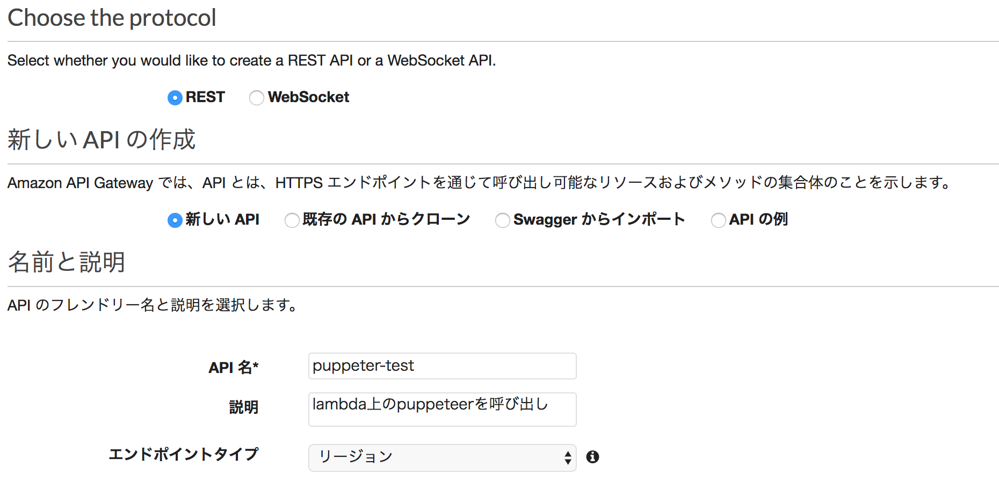

# puppeteer を Lambda 上で動かしてテスト自動化

**目次**

[[toc]]

## はじめに

### 目的

以前 puppeteer を使用してテストの自動化を行ったことはあるものの、結局自分が毎回コマンドを叩いていたので実質(半)自動化という状態でした。  
毎回叩くのもいささかめんどくさくなってきたので、Lambda 上に puppeteer をおいてボタン一つで自動化テストができるようにしたいと思います。  
今回想定したのはお客様情報の入力が必要なフォームなどのページですが(※EC サイトの購入ページのようなイメージです)、テストとして google に検索をしてレスポンスを確認できるところまでを実装します。
<br /><br />
まずは環境です。

- ローカル
  - Mac OS Sierra
  - Node.js v8.11.2
  - npm v6.4.1
- AWS Lambda
  - ランタイム：Node.js 8.10

## 構成について

今回は pupetter を GUI 経由で操作するために以下のような構成にします。
<br /><br />

<br /><br />
テストをおこなうサイトや設定項目は柔軟に変更したいので、URL の一覧などの設定ファイルは S3 において Lambda 経由で取得できるようにします。

## Lambda の環境構築

### 関数の作成とロールの設定

まずは Lambda 上で puppetter を使用するために Lambda の環境を構築します。  
今回は「puppeteer-test」という名前で関数を作成します。Lambda のコンソール上から関数の作成をクリックします。
<br /><br />


<br /><br />


<br /><br />

以下のように設定します。

- 名前: puppeteer-test
- ランタイム: Node.js 8.10
- ロール: S3 と cloudWatch へのポリシーが付与されたロール
- ロール名: 任意のロール名

<br />

なお puppeteer を Lambda 上で使用する場合処理の内容次第ではあるもののメモリとタイムアウト時間は適切に確保しないとメモリリークやタイムアウトを引きおこします。  
そのため今回は

- メモリ:1024MB
- タイムアウト:30 秒

に延長しています。
<br /><br />

<br /><br />
現在 Lambda のタイムアウト時間は最大 15 分ですが、処理に時間がかかるようなものを行う場合は、他の方法を模索する必要があります。

[AWS Lambda のタイムアウトが 15 分になりました](https://aws.amazon.com/jp/blogs/news/aws-lambda-timeout-15min/)

<br />

ロールに関しては

- S3 から設定ファイルを取得
- cloudWatch へのログの書き出し

を行いたいので以下のポリシーをアタッチしています。
<br /><br />


<br />
上記を指定したら「関数の作成」をクリックします。

### puppeteer を Lambda Layer へ追加する

puppeteer を Lambda で使用できるようにするために、Lambda Layer に puppeteer の登録を行います。  
pupeteer に限らず Lambda で外部のライブラリを複数の Lambda 関数で使用する場合は Lambda Layer に追加していくのが良いと思います。  
今回は以下の記事を参考にさせていただきました。
<br /><br />
[Lambda Layer の基本的な仕組みを確認する](https://dev.classmethod.jp/cloud/aws/Lambda-layer-basics-how-it-works/)  
[AWS Lambda で Puppeteer を動かす](https://qiita.com/kodai-saito/items/9051d2b30a29c7d64f7d)
<br /><br />
「chrome-aws-lambda」という名前でレイヤーを追加します。

### レイヤーの追加

先ほど作成した関数にレイヤーを追加します。  
作成した関数のページを開き「Layers」の箇所をクリックし「レイヤーの追加」を選び、該当の Layer を選択して追加します。
<br /><br />


<br />


### Lambda 関数のテスト

ここで実際に動かしてテストをしてみます。  
保存ボタンの隣にあるテストボタンをクリックし、テストイベントの設定を行います。

<br /><br />


```js : nodejs
const chromium = require('chrome-aws-lambda')
const puppeteer = require('puppeteer-core')

exports.handler = async (event, context) => {
  let result = null
  let browser = null

  try {
    browser = await puppeteer.launch({
      args: chromium.args,
      defaultViewport: chromium.defaultViewport,
      executablePath: await chromium.executablePath,
      headless: chromium.headless
    })

    let page = await browser.newPage()

    await page.goto(event.url || 'https://google.co.jp/')

    result = await page.title()
  } catch (error) {
    return context.fail(error)
  } finally {
    if (browser !== null) {
      await browser.close()
    }
  }

  return context.succeed(result)
}
```

上記のコードで保存ボタンの隣のテストをクリックして、レスポンスに「"Google"」が返ってきていれば成功です。
<br /><br />

<br />


## 設定ファイルを S3 に置く

設定ファイルを置くための s3 のバケットを作成します。  
今回は「puppeteer-conf」という名前で作成しました。
<br /><br />

<br /><br />
細かい設定などは割愛しますが、自分の環境下では過去に同じようなバケットを作成していたので、それに準拠する形で作成しました。

## Lambda 関数を作成

本来はもう少し入力項目の多いフォームに対する自動化を実装する予定ですが、テストとして google に検索をかけた内容をレスポンスとして返す関数を作ります。

とりあえず完成形。

```js : node.js
const chromium = require('chrome-aws-lambda')
const puppeteer = require('puppeteer-core')

const aws = require('aws-sdk')
const s3 = new aws.S3({ apiVersion: '2006-03-01' })

exports.handler = async (event, context) => {
  const bucket = 'puppeteer-conf'
  const keyUrls = decodeURIComponent('urls.json')

  const paramsUrls = {
    Bucket: bucket,
    Key: keyUrls
  }

  let result = {}
  let browser = null

  try {
    // urlの一覧
    const urlsConf = await s3.getObject(paramsUrls).promise()
    const urls = await JSON.parse(urlsConf.Body.toString('utf-8'))

    for (let i = 0; i < urls.length; i++) {
      browser = await puppeteer.launch({
        args: chromium.args,
        defaultViewport: chromium.defaultViewport,
        executablePath: await chromium.executablePath,
        headless: chromium.headless
      })
      let page = await browser.newPage()
      await page.goto(event.url || urls[i].url, { waitUntil: 'networkidle2' })
      console.log('browser start')

      // 該当のページがアクティブになるまで待つ(検索ボックスがactiveになるまで)
      await page.waitForSelector(urls[i].searchbox)

      // 検索語句を入力
      await page.focus(urls[i].searchbox)
      await page.type(urls[i].searchbox, urls[i].word)
      await page.waitFor(500)
      await page.keyboard.press('Enter')
      console.log('searchDone')

      // 検索結果が表示されるまで待つ
      await page.waitForSelector('span.st')
      const title = await page.title()
      // 検索結果1番目descriptionを取得
      const searchResult = await page.$eval('span.st', elem => {
        return elem.textContent
      })
      result[urls[i].word] = `【${title}】${searchResult}`
      await browser.close()
    }
  } catch (error) {
    return context.fail(error)
  } finally {
    if (browser !== null) {
      await browser.close()
    }
  }
  return context.succeed(result)
}
```

それぞれ解説していきます。

### 設定ファイルを S3 から読み出し

```json : s3 に置かれた url 一覧などを含んだ json ファイル。
[
  {
    "url": "https://www.google.com/?hl=ja",
    "searchbox": ".gLFyf",
    "word": "qiita"
  },
  {
    "url": "https://www.google.com/?hl=ja",
    "searchbox": ".gLFyf",
    "word": "アイマス"
  }
]
```

s3 に置いた json 形式の設定ファイルを読み込みます。  
今回は以下を指定しています。

- URL
- 検索ボックスの class
- 検索ワード

```js : node.js
const bucket = 'puppeteer-conf'
const keyUrls = decodeURIComponent('urls.json')
const paramsUrls = {
  Bucket: bucket,
  Key: keyUrls
}
```

作成した s3 のバケット名と json ファイルの名称を指定します。
ファイル名やバケット名は API のクエリとして渡すことで後で指定する想定ですが、ここでは一旦ベタで指定してしまいます。

```js : node.js
const urlsConf = await s3.getObject(paramsUrls).promise()
const urls = await JSON.parse(urlsConf.Body.toString('utf-8'))
```

読み込んだ設定ファイルをオブジェクト形式に変換します。

### ブラウザの立ち上げ

```js : node.js
browser = await puppeteer.launch({
  args: chromium.args,
  defaultViewport: chromium.defaultViewport,
  executablePath: await chromium.executablePath,
  headless: chromium.headless
})
let page = await browser.newPage()
await page.goto(event.url || urls[i].url, { waitUntil: 'networkidle2' })
```

puppeteer の設定を指定しています。  
設定はライブラリとして入れた「chrome-aws-lambda」の初期設定をそのまま使用しています。  
[chrome-aws-lambda](https://www.npmjs.com/package/chrome-aws-lambda)  
ちなみにそれぞれ以下がデフォルトの値として入っています。

```js : chromium.args
;[
  '--disable-accelerated-2d-canvas',
  '--disable-background-timer-throttling',
  '--disable-breakpad',
  '--disable-client-side-phishing-detection',
  '--disable-cloud-import',
  '--disable-default-apps',
  '--disable-dev-shm-usage',
  '--disable-extensions',
  '--disable-gesture-typing',
  '--disable-gpu',
  '--disable-hang-monitor',
  '--disable-infobars',
  '--disable-notifications',
  '--disable-offer-store-unmasked-wallet-cards',
  '--disable-offer-upload-credit-cards',
  '--disable-popup-blocking',
  '--disable-print-preview',
  '--disable-prompt-on-repost',
  '--disable-setuid-sandbox',
  '--disable-software-rasterizer',
  '--disable-speech-api',
  '--disable-sync',
  '--disable-tab-for-desktop-share',
  '--disable-translate',
  '--disable-voice-input',
  '--disable-wake-on-wifi',
  '--enable-async-dns',
  '--enable-simple-cache-backend',
  '--enable-tcp-fast-open',
  '--hide-scrollbars',
  '--media-cache-size=33554432',
  '--metrics-recording-only',
  '--mute-audio',
  '--no-default-browser-check',
  '--no-first-run',
  '--no-pings',
  '--no-sandbox',
  '--no-zygote',
  '--password-store=basic',
  '--prerender-from-omnibox=disabled',
  '--use-mock-keychain',
  '--memory-pressure-off',
  '--single-process'
]
```

```js : chromium.defaultViewport
{
  "deviceScaleFactor": 1,
  "hasTouch": false,
  "height": 1080,
  "isLandscape": true,
  "isMobile": false,
  "width": 1920
}
```

```js : chromium.executablePath
Promise { '/tmp/chromium' }
```

```js : chromium.headless
true
```

### 各種操作

```js : node.js
page.waitForSelector(selector)
```

所々でページ遷移が終わるまで待機する為に「page.waitForSelector」をいれています。

```js : node.js
await page.focus(urls[i].searchbox)
await page.type(urls[i].searchbox, urls[i].word)
await page.waitFor(500)
await page.keyboard.press('Enter')

// 検索結果が表示されるまで待つ
await page.waitForSelector('span.st')
const title = await page.title()
// 検索結果1番目descriptionを取得
const searchResult = await page.$eval('span.st', elem => {
  return elem.textContent
})
result[urls[i].word] = `【${title}】${searchResult}`
```

該当のページで検索ボックスに検索語句を入れて検索をします。  
最終的に検索した結果の 1 番目の description を取得して、結果を返却します。

返却されるレスポンスは以下です。

```js : node.js
{
  "qiita": "【qiita - Google 検索】Qiitaは、プログラマのための技術情報共有サービスです。 プログラミングに関するTips、ノウハウ、メモを簡単に記録 & 公開することができます。",
  "アイマス": "【アイマス - Google 検索】2018/10/05: 【アイドルマスター シンデレラガールズ スターライトクルーズ】公式サイトリニューアルオープン！ 2018/10/04: 【THE IDOLM＠STER MR ST@GE!! MUSIC♪GROOVE☆2nd SEASON】9月30日（日）主演：天海春香第三部の台風の影響による ..."
}
```

## API Gateway の設定

この Lambda を APIGateway 経由で WEB ページから叩けるようにします。

### API の作成

API の作成ボタンをクリックし、API を作成します。
<br /><br />

<br /><br />

- Choose the protocol : API
- 新しい API の作成: 新しい API
- 名前と説明: 任意の名前と説明

今回は以下のような設定で作成しました。
<br /><br />


### メソッドの設定

今回は Lambda 経由のレスポンスを取得するだけなので、get メソッドだけを作成します。
<br /><br />

- 統合タイプ: Lambda 関数
- Lamabda リージョン: Lambda 関数が所属しているリージョン
- Lambda 関数：作成した関数※今回は「puppeteer-test」

<br /><br />

<br /><br />

### CORS の設定

今回は UI から API のエンドポイントを叩いて取得する想定です。  
まずは確認のために localhost から叩くことになるかと思いますが、このままだと CORS に引っかかってレスポンスが返ってこないことが予想されます。
<br /><br />
そのため CORS の設定を行います。
<br /><br />


### API のデプロイ

一連の設定を行ったら API のデプロイを行います。  
今回は「dev」ステージを新規で作成し指定しています。

<br /><br />

<br />

<br /><br />

この時点でテストをして、先ほど Lambda 上で確認したレスポンスと同じものが返ってくるかどうか確認します。  
該当の API を選択し、GET メソッドを選択してテストボタンをクリックします。
<br /><br />

<br />


### UI からのテスト

さて、やっとここまでたどり着きました。
<br />
UI を作成し、localhost からレスポンスを叩いてみます。今回は vue.js で簡単な UI を作成しました。vue-cli をベースにして、vuetify でスタイルをつけた簡単なものです。
<br /><br />

<br /><br />
今回作成した API のエンドポイントを UI から叩いてみます。

```js
public scrapingUrl() {
  const self = this;
  const url =
    "APIのURL";
  fetch(url, {
    mode: "cors"
  })
    .then(response => {
      return response.json();
    })
    .then(json => {
      self.puppeteerRes = json;
    });
}
```

以下のようにレスポンスが返って来れば成功です。

<br /><br />

<br /><br />

## 今後の拡張

各種設定は API のクエリごとに違うものを取得するなど色々なサイトで使用ができるようにしていけるかと思います。
<br />
またこのままだと毎回設定ファイルを問い合わせる形になるので、なにがしかの形でキャッシュを考える必要もありそうです。
<br /><br />
他に今回は割愛しましたが、このままだとどこからでも叩ける状態になってしまっているので、API 側でリソースポリシーの設定をして特定の IP 以外は弾くようにしたり、WAF の設定を追加する必要はあります。  
S3 も同様です。

## まとめ

正直なところ Lambda 上で処理を行うことでコストもかかりますし、メンテナンスコストもそれなりにかかるので、一人でやる分には毎回コードを叩く形でも問題ないと感じています。
<br />
ただある程度大きな規模感のリリースを行う場合は、個人ではなくチームで動くことが多いので、手動でやっていたテストのボリュームが多ければ多いほど自動化テストが行える環境を構築しておく意味はあると思います。

## 参考

[Lambda Layer の基本的な仕組みを確認する](https://dev.classmethod.jp/cloud/aws/Lambda-layer-basics-how-it-works/)  
[AWS Lambda で Puppeteer を動かす](https://qiita.com/kodai-saito/items/9051d2b30a29c7d64f7d)
