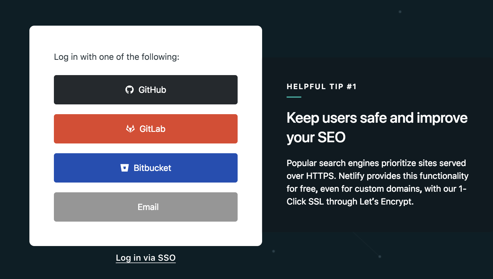
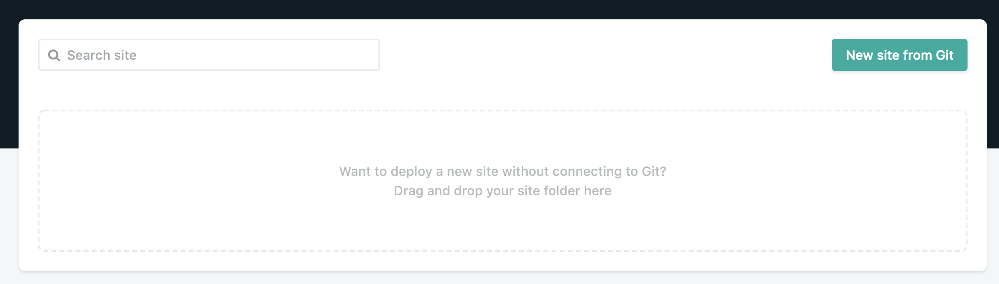
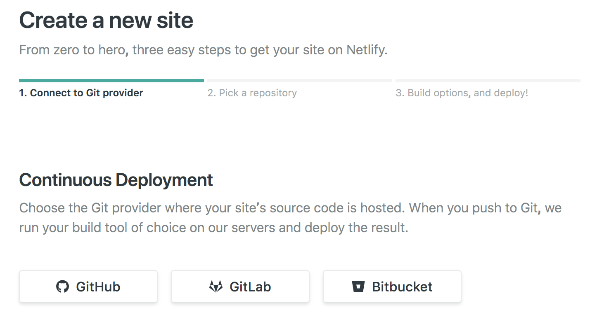
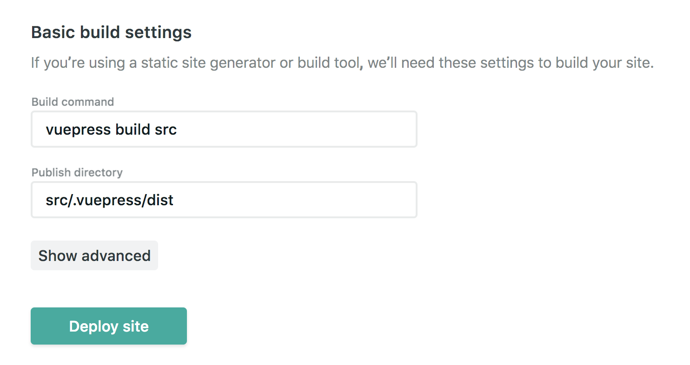

# VuePressとnetlifyで手軽にblogをはじめる

## はじめに
年初にやりたいことをリストアップしていて、定期的なアウトプットというのもその中に入っていました。  
それが気づいたらもうど年末(これを書いているのは2018年12月31日)。  
アウトプットするのに自前のblogという形態にこだわる必要もないんですが、せっかくなら自分で一から作って見ようということで、今回VuePressという静的サイトジェネレーターを使って、blog(今は機能的にはモドキ)を作っていきます。

**目次**

[[toc]]

## なぜVuePressなのか

こういうのって結局やりたいときに一気にどこまで進められるか初速が大きいと思っていて、その意味でも今自分が持っているスキルセットで実装しやすいものという観点で調べて行きました。  
調べていく中でGatsbyやHugoなども検討には上がりましたが、今自分がメインで使用しているのがVueなこともあり、調べていく中でVueをベースとした静的サイトジェネレータとしてVuePressを見つけ、これなら比較的楽に導入できるんじゃないかと思って選択をしました。    
何よりまだ新しいサービス(まだ1系はbeta版で、今回入れたのは`Ver1.0.0-alpha.29`)に手を出すのはいつの世も楽しいものです(勿論辛みもある)。

## インストールから初回立ち上げ
今回はglobalではなくてlocalにインストールします。  
ディレクトリを作成して、サクッとインストール。

今回はyarnを使ってますがnpmでもインストール可能です。

``` sh
mkdir vue-press-blog
cd vue-press-blog
npm init
yarn add -D vuepress
```

今回は1系を入れてやりたいので以下のように変更します。

``` sh
yarn add -D vuepress
↓
yarn add -D vuepress@next
```

::: warning
まだ1系に関してはbeta版ですが、公式のドキュメントが既に1系に準拠しているので、今回は1系を導入しています。
:::


### 初回立ち上げまで

`src`ディレクトリを追加して、直下に`README.md`と`.vuepress`ディレクトリを作成し、    
さらに`.vuepress`ディレクトリの中に`config.js`を追加しておきます。  

``` sh
mkdir src
mkdir .vuepress
touch README.md
cd .vuepress
touch config.js
```

`src`ディレクトリの直下の`README.md`には以下を記載しておきます。

```md
# Hello VuePress
```

`config.js`には以下を記載しておきます。
config.js
```js
module.exports = {
  title: 'Hello World!'
}
```

公式だと`doc`ディレクトリ内にコンテンツを置いていますが、今回は`src`ファイル内にコンテンツを書いていく想定なので`package.json`内に以下を記載します。

``` json
{
  "scripts": {
    "dev": "vuepress dev src",
    "build": "vuepress build src"
  }
}
```
ここで一回立ち上げてみます。

```
yarn dev
```

うまくいっていれば`http://localhost:8080`で今の状態を見れるはずです。headerに`Hello World!`、コンテンツ内に`Hello VuePress`とあれば成功です。


### ディレクトリ構成

ここで現在の構成の確認。  
この時点ではデフォルトのテーマが読み込まれています。カスタムする部分に関しては基本的に`.vuepress`ディレクトリ内部にファイルを追加していく構成です。

参考：[https://VuePress.vuejs.org/guide/directory-structure.html#default-page-routing](https://VuePress.vuejs.org/guide/directory-structure.html#default-page-routing)

```
vue-press-blog
├─ node_modules
├─ package.json
└─ src
    ├─ README.md  
    └─ .vuepress
       └─ config.js

```

## 初期設定
### config.jsについて
他の記事でも言及されていますが、VuePressにおいて`config.js`はかなり重要なファイルです。
多くのことがこのファイルで設定できますが、今回は最低限の部分設定していきます。

リファレンスはここを[参照](https://VuePress.vuejs.org/guide/basic-config.html)してください。

### metaの設定
meta情報を変更したい場合はheadのなかに配列を記載していくだけです。  
metaネームと実際に入れる内容に関してはobjectで指定していきます。

``` js
  head: [
    ['link', { rel: 'icon', type: 'image/jpg', href: '/favicon.jpg' }],
    ['meta',{ name:"keywords", content:"vuepress, netlify"}],
    ['meta',{ name:"og:title", content:"og title"}],
    ['meta',{ name:"og:description", content:"description"}],
    ['meta',{ name:"og:type", content:"website"}],
    ['meta',{ name:"og:url", content:"og　url"}]
  ]
```

各ページごとに設定する場合は各記事の頭に以下の記法で記載します。  
公式のドキュメントは[こちら](https://vuepress.vuejs.org/guide/frontmatter.html#alternative-front-matter-formats)を参照してください。

``` md
---
title: Top Pageだけ別
description: Top description
meta:
 -
  og:title: 'vuepress_test top'
 -
  og:desciption: 'vuepress_test test description'
 -
  og:image: 'vuepress_test_top.png'
 ---
```

### favicon
faviconもheadの中に該当のファイルへのパスを記載します。  
実際のファイルは`src/.vuepewss/public`ディレクトリに画像ファイルをおけばOKです。  

### その他
言語ごとにmetaデータを変更したり、プラグインの設定なども`config.js`に設定を書くのが基本になってきます。  
サイドバーやヘッダのナビゲーションもここに書いていきます。

## 各機能など
### 色の変更
そのままでも使えますがdefaultはvueで使用されているカラーが基調になっているので、変更したい場合は`.VuePress/styles/palette.styl`にstylファイルを置いておけばOKです。

::: warning
なお1系からファイル名と配置ディレクトリが変わっている模様。  
`.VuePress/override.styl` → `.VuePress/styles/palette.styl`  
:::

### markdown
基本的な記事に関してはmarkdownで書いていく形になります。markdownの記法はあらかた使えるので、[こちら](https://VuePress.vuejs.org/guide/markdown.html#links)を参照して書いていきます。

## vueの記法

公式のドキュメントを見ると以下のような記載があります。

::: tip
Each markdown file is first compiled into HTML and then passed on as a Vue component to `vue-loader`. This means you can use Vue-style interpolation in text:

各マークダウンファイルは、まずHTMLにコンパイルされ、次にVueコンポーネントとして`vue-loader`に渡されます。  
これは、テキストでVueスタイルの補間を使用できることを意味します。
:::

要はVueのテンプレート構文におけるような処理が使えます。

#### 計算結果を出力してみたり

input 
``` md
{{ 1 + 1 }}
```
output
``` md
2
```

#### イテレートされたリスト出力もできます

input
```html
<span v-for="i in 3">{{ i }}リスト<br></span>
```

output
```
1リスト
2リスト
3リスト
```

#### コンポーネントの作成
vueで使用しているようなコンポーネントも使用することができます。
コンポーネントに関してはこちらが詳しかったので参考にリンクを貼らせていただきます。

[https://blog.dojineko.ninja/2018/04/15/try-VuePress/](https://blog.dojineko.ninja/2018/04/15/try-VuePress/)

vueファイルとして普通に書けば動くので結構便利ですね。  
あまり凝るとシンプルに作る方向性から外れてしまうので、 良い落とし所を模索したい所です。

#### プリプロセッサやテンプレートに関して
もちろんscssやpugなども使えます。

``` sh
yarn add -D sass-loader node-sass
```
``` sh
yarn add -D pug pug-plain-loader
```
``` css
<style lang="sass">
.title
  font-size: 20px
</style>
```
#### GAの設定
記事がどれくらい読まれているのか確認しておきたいので、GAを入れておきます。

``` json
plugins: {
  '@vuepress/google-analytics': {
    ga: 'UA-12345678-9'
  }
}
```
::: warning
0系はconfig.jsに記載する形ですんでいたようですが、1系からは独立したプラグインとして配信されているようなので、インストールして設定します。  
[参考](https://VuePress.vuejs.org/miscellaneous/migration-guide.html#ga
)
:::

## deploy
### なにで配信をするのか
VuePressのサイトには色々な配信方法が[紹介](https://vuepress.vuejs.org/guide/deploy.html)されています。GitHubPagesでもよかったんですが、今回はnetlifyを選択します。

### 登録
まずは[app.netlify](https://app.netlify.com/)ページで配信を行いたいページのソースコードが含まれたアカウントと連携をします。

今回はGitHubとの連携になるので一番上のでGitHubを選択します。



---

今回配信したいサイトのソースコードが含まれているリポジトリを選択。



---

GitHubとの連携を選択してそのまま先に進みます。


---

途中でデプロイコマンドとどこのディレクトリをbuildディレクトリにするのか選ぶ箇所がありますが、今回は`doc`から`src`に変更しているので、そこは変更しておきます。



デプロイまでできたら色々な設定ができるようになります。  
+ デプロイタイミングの設定
+ カスタムドメインの設定
+ HTTPSの設定
+ etc...

## 今後について
まだblogの機能については実装されていないみたいなので、  
自分で実装できそうな部分に関しては自前で設定していく必要がありそうです。

あくまでもblogとしてで考えた場合どこまで手をつけるのか、というところはありますがPWAやplugin・component実装など色々なことができる印象があるので、今後はその辺りも深掘りを行っていく予定です。
